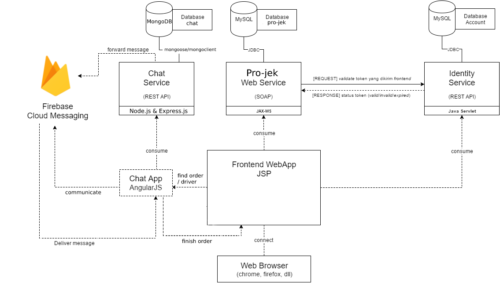
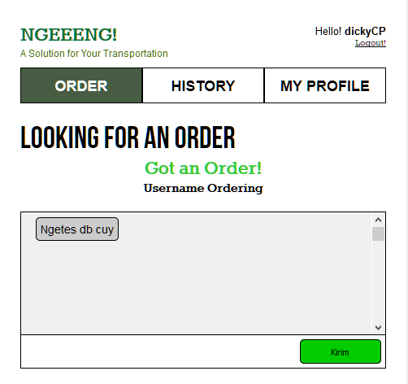

# Tugas 3 IF3110 Pengembangan Aplikasi Berbasis Web

Melakukan upgrade Website ojek online sederhana pada Tugas 2 dengan mengaplikasikan ***cloud service* (Firebase Cloud Messaging) dan *framework* MEAN stack**.

## Tujuan Pembuatan Tugas

Diharapkan dengan tugas ini Anda dapat mengerti:
* MEAN stack (Mongo, Express, Angular, dan Node)
* *Cloud service* Firebase Cloud Messaging (FCM) dan kegunaannya.
* Web security terkait access token dan HTTP Headers.

## Anggota Tim
Setiap kelompok beranggotakan **3 orang dari kelas yang sama**. Jika jumlah mahasiswa dalam satu kelas modulo 3 menghasilkan 1, maka hanya 1 kelompok terdiri dari 4 mahasiswa. Jika jumlah mahasiswa modulo 3 menghasilkan 2, maka ada dua kelompok yang beranggotakan 4 orang. Anggota kelompok harus berbeda dengan tugas 1 dan tugas 2.
1. Finiko Kasula Novenda - 13515029
2. Aya Aurora Rimbamorani - 13515098
3. Alif Ijlal Wafi - 13515122
4. Francisco Kenandi Cahyono - 13515140

### Arsitektur Umum
Tugas 3 ini terdiri dari komponen Tugas 2 dan tambahan yang harus dibuat:
* `Pemanfaatan FCM`: Pengiriman pesan dari pelanggan ke driver atau sebaliknya dengan menggunakan layanan Firebase Cloud Messaging (FCM).
* `Implementasi MEAN stack`: Membuat REST service untuk keperluan layanan chat memanfaatkan FCM menggunakan Node, Express dan Mongo, serta membuat halaman chat yang menggunakan Angular.

### Tampilan Program

Halaman Order pada Driver Ketika Mendapat Order

### Referensi Terkait
Berikut adalah referensi yang dapat Anda baca terkait tugas ini:
1. https://firebase.google.com/docs/web/setup
2. https://firebase.google.com/docs/cloud-messaging/js/client
3. https://docs.angularjs.org/api

### Pembagian Tugas

Tugas kali ini cukup rumit, karena melibatkan layanan dari pihak ketiga, dan framework. Bila tak mengerti, luangkan waktu belajar lebih banyak. Bila belum juga mengerti, belajarlah bersama-sama kelompokmu. Bila Anda sekelompok bingung, bertanyalah (bukan menyontek) ke teman seangkatanmu. Bila seangkatan bingung, bertanyalah pada asisten manapun.

Chat App Front-end :
1. 13515029   

Chat Service:  
1. 13515122  

Firebase Implementation:
1. 13515140

MongoDB implementation:
1. 13515098

## About

Asisten IF3110 2016

Ade | Johan | Kristianto | Micky | Michael | Rangga | Raudi | Robert | Sashi

Dosen : Yudistira Dwi Wardhana | Riza Satria Perdana | Muhammad Zuhri Catur Candra
